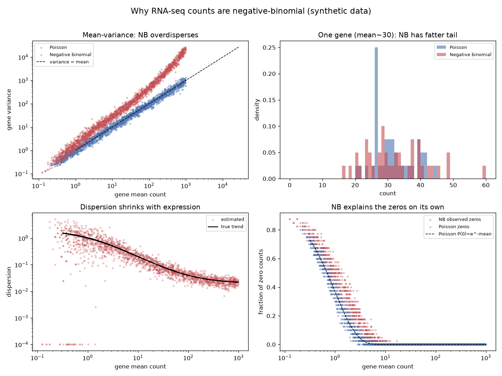

# Negative Binomial RNA-seq Counts

Someone hands you a gene-expression count matrix and asks you to find what changed. Before you run a single test, one modelling choice quietly decides whether your results are real or noise: **do you treat the counts as Poisson, or as negative binomial?** Get this wrong and you will call hundreds of "significant" genes that are pure sampling noise.

## Demo Output



The figure is produced entirely from simulated data by `demo.py` — no downloads, no real dataset required. It contrasts Poisson and negative-binomial (NB) counts across 2,000 genes and 40 samples.

## Why This Exists

Read counts are non-negative integers, so the textbook reflex is to reach for the Poisson distribution. The Poisson has exactly one parameter, and it carries a hidden, fatal assumption: **the variance equals the mean.** Biology does not agree. The same gene measured across supposedly identical replicates varies far more than Poisson allows, because real samples differ in ways the model never sees — cell-state, batch, individual. That excess variance is called *overdispersion*, and it is the single most important fact about count data.

The negative binomial fixes this by adding a dispersion parameter, so the variance becomes `mean + dispersion * mean^2`. That extra quadratic term is what lets the model breathe. It is exactly why DESeq2, edgeR, and every serious RNA-seq tool are built on the NB and not on the Poisson.

## How It Works

The demo simulates a realistic count matrix and then interrogates it four ways:

1. **Mean-variance relationship.** For every gene it plots variance against mean. Poisson genes sit on the `variance = mean` line; NB genes float above it. That gap *is* overdispersion, made visible.
2. **One gene, up close.** For a moderately expressed gene it overlays the Poisson and NB count histograms. The NB has a visibly fatter tail — the occasional large count that Poisson would flag as impossible.
3. **Dispersion vs expression.** Using a method-of-moments estimate, it recovers the per-gene dispersion and shows the familiar trend: dispersion is high for lowly expressed genes and shrinks as expression rises. This is the curve DESeq2 fits and shares across genes.
4. **The zero-inflation question.** A long-running debate asks whether single-cell RNA-seq is "zero-inflated" — whether it has *more* zeros than a count model predicts. The demo shows that the NB already generates a large fraction of zeros for low-expression genes on its own. Before you bolt on a special zero-inflation component, check whether plain NB already explains your zeros. Usually it does.

## When NOT to Reach for This

If your data are genuinely equidispersed (technical replicates of a controlled spike-in, say), the Poisson is simpler and fine. And if you are working with normalised, log-transformed, roughly continuous values rather than raw counts, you are in a different modelling world — use a Gaussian-based method and stop worrying about dispersion.

## The Uncomfortable Truth

Most false discoveries in differential expression are not exotic statistical failures. They are the boring consequence of pretending the variance equals the mean. The Poisson underestimates real variability, p-values come out too small, and a pile of noise genes cross your threshold. Modelling overdispersion is not a nicety — it is the difference between a result and an artefact.

## Run It

```bash
pip install -r requirements.txt
python demo.py
```

`nb_counts.py` holds the reusable helpers (`simulate_nb`, `estimate_dispersion`, `overdispersion_ratio`) if you want to characterise your own matrix.

## Further Reading

Inspired by Ming 'Tommy' Tang, *From cell line to command line* — the chapters on the negative binomial distribution and whether single-cell RNA-seq data is zero-inflated (https://divingintogeneticsandgenomics.com/).

> Demonstrated on synthetic data, so the whole thing is reproducible with no external downloads.
